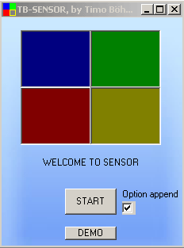

<div align="center">

## TB\-Sensor


</div>

### Description

I just wanted to show how you can resize your form by using the "for each - next" methode. But when I was writing the code, I'd like to show any good solution why this code could be nice. I think you know the game "sensor". You have to play the same sounds like the computer plays. I'm not good in English but just have a look and tell me the level you reach :-)
 
### More Info
 
I've included Wave files and a picture. You can modify it or let them away if there are any problems.


<span>             |<span>
---                |---
**Submitted On**   |2007-03-09 12:25:02
**By**             |[Timo Boehme](https://github.com/Planet-Source-Code/PSCIndex/blob/master/ByAuthor/timo-boehme.md)
**Level**          |Intermediate
**User Rating**    |4.7 (14 globes from 3 users)
**Compatibility**  |VB 5\.0, VB 6\.0
**Category**       |[Games](https://github.com/Planet-Source-Code/PSCIndex/blob/master/ByCategory/games__1-38.md)
**World**          |[Visual Basic](https://github.com/Planet-Source-Code/PSCIndex/blob/master/ByWorld/visual-basic.md)
**Archive File**   |[TB\-Sensor2053563132007\.zip](https://github.com/Planet-Source-Code/timo-boehme-tb-sensor__1-68082/archive/master.zip)

### API Declarations

```
Private Declare Function PlaySound Lib "winmm.dll" Alias "PlaySoundA" ( _
 ByVal lpszName As String, _
 ByVal hModule As Long, _
 ByVal dwFlags As Long) As Long
Private Declare Function GetShortPathName Lib "kernel32" Alias "GetShortPathNameA" ( _
 ByVal lpszLongPath As String, _
 ByVal lpszShortPath As _
 String, _
 ByVal cchBuffer As Long) As Long
```


